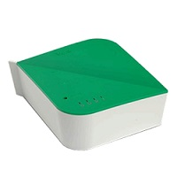

# KiepLamp
### C# WPF application for switching devices and running scenes on Vera Z-wave controller
This application can trigger scenes or switch devices based on command line options. It will show a rotating icon in the middle of the screen while running, and for 2 seconds a green or red icon when completed.

Example:
```
KiepLamp.exe -ip 192.168.0.2 -device 12 -value 1
KiepLamp.exe -ip 192.168.0.2 -device 12 -value 0
KiepLamp.exe -ip 192.168.0.2 -scene 8
```

